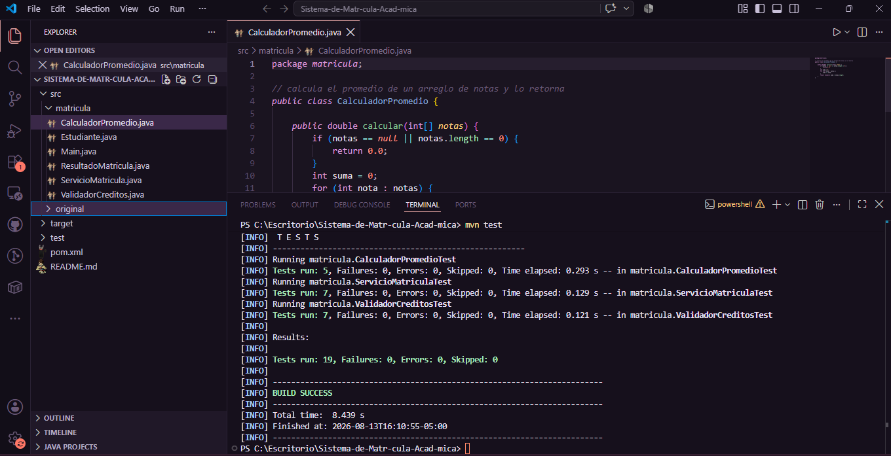

# Sistema de Matricula Academica

**Estudiantes:**
- Genesis Rodriguez Arcos
- Duban Salas Napan
- Luis Rivas Rojas

## Captura de Pantalla - Tests en Verde

## Explicacion de Cambios

El codigo original tenia todo mezclado en una sola clase, los metodos calculaban cosas y a la vez imprimian en consola, eso hacia imposible hacer pruebas porque no retornaban ningun valor. Ademas la validacion de creditos estaba copiada en dos metodos distintos, si se cambiaba el limite habia que modificarlo en dos lugares.

Lo que hicimos fue separar todo en clases distintas. ValidadorCreditos se encarga solo de verificar si los creditos son validos, CalculadorPromedio solo calcula y retorna el resultado, ServicioMatricula maneja el proceso de matricula y ResultadoMatricula guarda el resultado para poder revisarlo despues. El Main es el unico lugar donde se imprime en consola.

Con eso ya pudimos escribir las pruebas unitarias porque cada metodo retorna algo concreto que se puede comparar con assertEquals o assertTrue. En el codigo original eso no era posible porque los metodos no retornaban nada, solo imprimian.

## Preguntas de Reflexion

**1. Diagnostico inicial**
El problema mas obvio era que los metodos mezclaban la logica con System.out.println. Por ejemplo calcularPromedio hacia el calculo pero no retornaba nada, solo imprimia, entonces no habia forma de verificar si el resultado era correcto sin leer la consola a mano. Tambien habia codigo repetido, la misma validacion de creditos aparecia dos veces.

**2. Decisiones de diseno**
Separamos cada responsabilidad en su propia clase. La decision mas importante fue hacer que los metodos retornen valores en vez de imprimir, porque eso es lo que permite despues hacer aserciones en las pruebas. Tambien centralizamos la validacion de creditos en un solo lugar para no tener que repetirla.

**3. Impacto en la testabilidad**
El codigo refactorizado es mucho mas facil de probar porque cada metodo hace una sola cosa y retorna un resultado. En las pruebas solo hay que preparar los datos, llamar al metodo y comparar lo que retorna con lo que se esperaba. Con el codigo original eso no se podia hacer.

**4. Calidad del software**
Aprendimos que si el codigo esta bien estructurado las pruebas se escriben solos casi. Cuando un metodo mezcla muchas cosas es dificil saber que parte fallo. Al separar responsabilidades cada prueba apunta a algo especifico y cuando falla sabes exactamente donde esta el problema.
